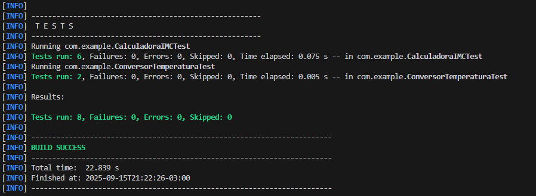

# Exercicio de Testes Unitarios!
# Aluno: Gabriel Martins

## Foi utilizado o JUnit 5 para os testes automatizados em Java, juntamente com o maven para gerenciamento de dependências (necessário para usar o JUnit). Resultado:

